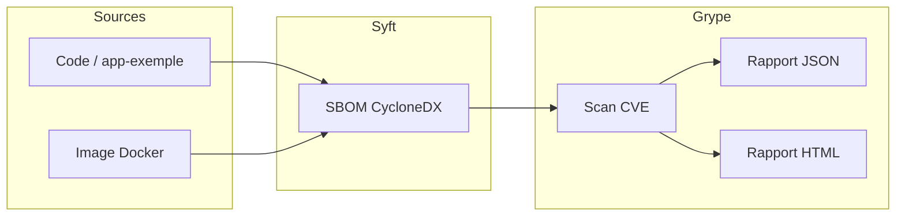

# Syft + Grype – SBOM & Scan vulnérabilités (CI/CD)

[](https://github.com/tine50/Sysft-Grype-CICD/actions/workflows/sbom-grype.yml)

Projet **Security M2** : génération de **SBOM** (Syft), scan des **vulnérabilités** (Grype), pipeline automatisé et intégration **CI/CD** avec GitHub Actions. Idéal pour la traçabilité des dépendances, l’audit de conformité (NIS2, ANSSI) et la détection des CVE sur du code ou des images Docker.

---

## En bref

| Ce que fait le projet | Pourquoi c’est utile |
|------------------------|----------------------|
| **Inventaire (SBOM)** | Liste reproductible de tous les paquets (npm, apk, etc.) – répertoire ou image Docker. |
| **Scan CVE (Grype)** | Détection des vulnérabilités connues sur cet inventaire, avec seuil (ex. bloquer si critical). |
| **Rapport HTML** | Synthèse lisible des vulnérabilités (`rapports/vulns-report.html`) en plus du JSON. |
| **Diff SBOM** | Comparer deux SBOM (baseline vs actuel) pour voir les ajouts/suppressions de paquets. |
| **CI/CD** | À chaque push/PR : SBOM + Grype + artefacts (SBOM, rapport vulns, rapport HTML). |

---

## Schéma du pipeline



---

## Démarrage rapide (local)

1. **Installer Syft et Grype** (Windows) :
   ```powershell
   winget install Anchore.syft
   winget install Anchore.grype
   ```

2. **Tout en une commande** (SBOM + vulnérabilités + rapport HTML) :
   ```powershell
   .\syft-grype-pipeline.ps1
   .\generer-rapport-vulns-html.ps1
   ```

3. **Ouvrir le rapport** : `rapports/vulns-report.html`

Pour **scanner l’image Docker** (build + SBOM + Grype) :
```powershell
.\syft-grype-pipeline.ps1 -CibleImage "app-exemple-sbom:1.0" -ConstruireImage
.\generer-rapport-vulns-html.ps1
```

---

## Contenu du dépôt

| Élément | Description |
|--------|-------------|
| **app-exemple/** | Application Node.js exemple (express, lodash, axios) – cible des scans. |
| **syft-grype-pipeline.ps1** | Pipeline Syft → Grype (SBOM + rapport vulns). Option `-FailOnSeverity critical`. |
| **generer-rapport-vulns-html.ps1** | Génère `rapports/vulns-report.html` à partir de `rapports/vulns.json`. |
| **comparer-sbom.ps1** | Compare deux SBOM CycloneDX (baseline vs actuel) – ajouts, suppressions, versions. |
| **generer-sbom.ps1** | Génère SBOM (CycloneDX, SPDX, Syft JSON) du répertoire. |
| **generer-sbom-docker.ps1** | SBOM d’une image Docker (option `-ConstruireAppExemple`). |
| **.syft.yaml** | Config Syft (exclusions, scope). |
| **.github/workflows/sbom-grype.yml** | CI : SBOM + Grype + artefacts (dont rapport HTML si généré). |
| **docs/SYFT_CAS_COMPLET.md** | Guide complet : config, Grype, Dependency-Track, attestations, conformité. |
| **docs/RAPPORT_SBOM_TEMPLATE.md** | Modèle de rapport à compléter (cas pratique M2). |

---

## CI/CD (GitHub Actions)

Le workflow **`.github/workflows/sbom-grype.yml`** s’exécute sur chaque **push** et **pull_request** vers `main` :

- Installation de Syft et Grype  
- Génération du SBOM (répertoire `app-exemple`)  
- Scan Grype (table + JSON)  
- Upload des artefacts : **sbom-cyclonedx**, **vulns-report**

Pour **faire échouer le job en cas de vulnérabilité critical** : décommenter la step `Fail on critical` dans le workflow.

---

## Aller plus loin

- **Rapport HTML** : après le pipeline, lancer `.\generer-rapport-vulns-html.ps1` et ouvrir `rapports/vulns-report.html`.
- **Comparaison SBOM** : `.\comparer-sbom.ps1 -Baseline rapports/sbom-baseline.json -Actuel rapports/sbom-cyclonedx.json`
- **Guide complet** : [docs/SYFT_CAS_COMPLET.md](docs/SYFT_CAS_COMPLET.md) (Dependency-Track, attestations Syft/Cosign, conformité NIS2/ANSSI).

---

## Licence & contexte

Projet réalisé dans le cadre du cours **Security M2** – gestion des dépendances, SBOM et chaîne de confiance logicielle.
